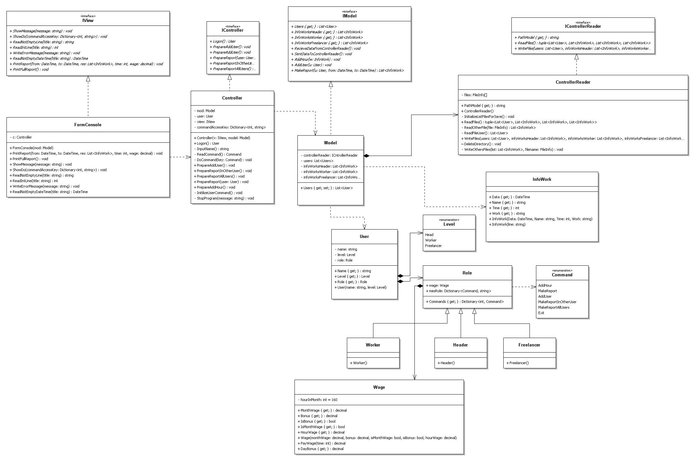

Приложение разработанное по техническому заданию программиста по C# Степана Берегового с канала C# c нуля
https://docs.google.com/document/d/1kZz1ozAwNTVkIxWoyPYI_zTw6mos3CI03MyXnCxNbeM/edit
Представляет собой консольнье приложение разработанное по MVC шаблону с ООП, с возможностью сохранения данных программы в файл и в БД
с unit тестированием части Persistance.
uml-диаграмма

В дальнешем предполагается добавление возможности сохранения с сериализацией файлов,
с реализацией десктопной части на WPF.